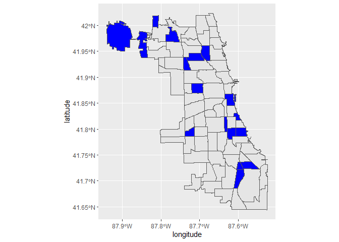

# R Programming

## Set Chunk requirements


```r
knitr::opts_chunk$set(echo = TRUE, message = TRUE, warning = FALSE)
#echo=FALSE indicates that the code will not be shown in the final document 
#(though any results/output would still be displayed).
#include=FALSE to have the chunk evaluated, but neither the code nor its output displayed
# warning=FALSE and message=FALSE suppress any R warnings or messages from being included 
#in the final document
```


## Load Relevant Packages and Data Set

```r
library(sf)
```

```
## Linking to GEOS 3.6.1, GDAL 2.2.3, PROJ 4.9.3
```

```r
# Reading our dataset
setwd('E:/Documents/Reinp/GitHub Respositories/sf_Package_Tutorial')

comms <- st_read("Data-Chicago-geo/Chicago_Community_Areas.geojson")
```

```
## Reading layer `Chicago_Community_Areas' from data source `E:\Documents\Reinp\GitHub Respositories\sf_Package_Tutorial\Data-Chicago-geo\Chicago_Community_Areas.geojson' using driver `GeoJSON'
## Simple feature collection with 77 features and 4 fields
## geometry type:  MULTIPOLYGON
## dimension:      XY
## bbox:           xmin: -87.94011 ymin: 41.64454 xmax: -87.52414 ymax: 42.02304
## epsg (SRID):    4326
## proj4string:    +proj=longlat +datum=WGS84 +no_defs
```

```r
bus_routes <- st_read("Data-Chicago-geo/CTA_Bus_Routes.geojson")
```

```
## Reading layer `CTA_Bus_Routes' from data source `E:\Documents\Reinp\GitHub Respositories\sf_Package_Tutorial\Data-Chicago-geo\CTA_Bus_Routes.geojson' using driver `GeoJSON'
## Simple feature collection with 127 features and 6 fields
## geometry type:  MULTILINESTRING
## dimension:      XY
## bbox:           xmin: 1106137 ymin: 1813802 xmax: 1204805 ymax: 1966921
## epsg (SRID):    3435
## proj4string:    +proj=tmerc +lat_0=36.66666666666666 +lon_0=-88.33333333333333 +k=0.9999749999999999 +x_0=300000.0000000001 +y_0=0 +ellps=GRS80 +towgs84=0,0,0,0,0,0,0 +units=us-ft +no_defs
```

```r
libraries <- st_read("Data-Chicago-geo/Chicago_Libraries.geojson")
```

```
## Reading layer `Chicago_Libraries' from data source `E:\Documents\Reinp\GitHub Respositories\sf_Package_Tutorial\Data-Chicago-geo\Chicago_Libraries.geojson' using driver `GeoJSON'
## Simple feature collection with 81 features and 4 fields
## geometry type:  POINT
## dimension:      XY
## bbox:           xmin: -87.8175 ymin: 41.65473 xmax: -87.5335 ymax: 42.00671
## epsg (SRID):    4326
## proj4string:    +proj=longlat +datum=WGS84 +no_defs
```

```r
View(comms)
View(bus_routes)
View(libraries)

print(comms)
```

```
## Simple feature collection with 77 features and 4 fields
## geometry type:  MULTIPOLYGON
## dimension:      XY
## bbox:           xmin: -87.94011 ymin: 41.64454 xmax: -87.52414 ymax: 42.02304
## epsg (SRID):    4326
## proj4string:    +proj=longlat +datum=WGS84 +no_defs
## First 10 features:
##    NID       community POP2000 POP2010                       geometry
## 1    1     ROGERS PARK   63484   54991 MULTIPOLYGON (((-87.65456 4...
## 2    2      WEST RIDGE   73199   71942 MULTIPOLYGON (((-87.68465 4...
## 3    3          UPTOWN   63551   56362 MULTIPOLYGON (((-87.64102 4...
## 4    4  LINCOLN SQUARE   44574   39493 MULTIPOLYGON (((-87.67441 4...
## 5    5    NORTH CENTER   31895   31867 MULTIPOLYGON (((-87.67336 4...
## 6    6       LAKE VIEW   94817   94368 MULTIPOLYGON (((-87.64102 4...
## 7    7    LINCOLN PARK   64320   64116 MULTIPOLYGON (((-87.63182 4...
## 8    8 NEAR NORTH SIDE   72811   80484 MULTIPOLYGON (((-87.62446 4...
## 9    9     EDISON PARK   11259   11187 MULTIPOLYGON (((-87.80676 4...
## 10  10    NORWOOD PARK   37669   37023 MULTIPOLYGON (((-87.78002 4...
```

```r
print(bus_routes)
```

```
## Simple feature collection with 127 features and 6 fields
## geometry type:  MULTILINESTRING
## dimension:      XY
## bbox:           xmin: 1106137 ymin: 1813802 xmax: 1204805 ymax: 1966921
## epsg (SRID):    3435
## proj4string:    +proj=tmerc +lat_0=36.66666666666666 +lon_0=-88.33333333333333 +k=0.9999749999999999 +x_0=300000.0000000001 +y_0=0 +ellps=GRS80 +towgs84=0,0,0,0,0,0,0 +units=us-ft +no_defs
## First 10 features:
##    ROUTE               NAME WKDAY SAT SUN SHAPE_LEN
## 1    108       HALSTED/95TH     1   0   0  57020.44
## 2      9            ASHLAND     1   1   1 102284.26
## 3     93   CALIFORNIA/DODGE     1   1   0  46463.06
## 4     53            PULASKI     1   1   1  57028.29
## 5     22              CLARK     1   1   1  73440.32
## 6     54             CICERO     1   1   1  42341.75
## 7     35               35TH     1   1   1  52025.35
## 8    171 U OF C - HYDE PARK     1   1   1  21601.70
## 9     94   SOUTH CALIFORNIA     1   1   1  69850.98
## 10   115      PULLMAN/115TH     1   1   1  62340.86
##                          geometry
## 1  MULTILINESTRING ((1174621 1...
## 2  MULTILINESTRING ((1169198 1...
## 3  MULTILINESTRING ((1154101 1...
## 4  MULTILINESTRING ((1149872 1...
## 5  MULTILINESTRING ((1175366 1...
## 6  MULTILINESTRING ((1144797 1...
## 7  MULTILINESTRING ((1155617 1...
## 8  MULTILINESTRING ((1184739 1...
## 9  MULTILINESTRING ((1164218 1...
## 10 MULTILINESTRING ((1167732 1...
```

```r
print(libraries)
```

```
## Simple feature collection with 81 features and 4 fields
## geometry type:  POINT
## dimension:      XY
## bbox:           xmin: -87.8175 ymin: 41.65473 xmax: -87.5335 ymax: 42.00671
## epsg (SRID):    4326
## proj4string:    +proj=longlat +datum=WGS84 +no_defs
## First 10 features:
##                             name_                   address
## 1                 Vodak-East Side         3710 E. 106th St.
## 2                     Albany Park       3401 W. Foster Ave.
## 3                          Avalon 8148 S. Stony Island Ave.
## 4                        Brainerd          1350 W. 89th St.
## 5  Popular Library at Water Works        163 E. Pearson St.
## 6                    Little Italy        1336 W. Taylor St.
## 7                       Edgebrook        5331 W. Devon Ave.
## 8                           Kelly      6151 S. Normal Blvd.
## 9                       Edgewater      6000 N. Broadway St.
## 10                   North Austin        5724 W. North Ave.
##                                                         hours_of_operation
## 1   Sun., Closed; Mon. & Wed., Noon-8; Tue. & Thu., 10-6; Fri. & Sat., 9-5
## 2   Sun., Closed; Mon. & Wed., 10-6; Tue. & Thu., Noon-8; Fri. & Sat., 9-5
## 3   Sun., Closed; Mon. & Wed., Noon-8; Tue. & Thu., 10-6; Fri. & Sat., 9-5
## 4   Sun., Closed; Mon. & Wed., 10-6; Tue. & Thu., Noon-8; Fri. & Sat., 9-5
## 5                            Mon. - Thu., 9-7; Fri. & Sat., 9-5; Sun., 1-5
## 6  Sun., Closed; Mon. & Wed., Noon-8; Tue. & Thu., 10-6; Fri. & Sat., 9-5l
## 7   Sun., Closed; Mon. & Wed., Noon-8; Tue. & Thu., 10-6; Fri. & Sat., 9-5
## 8   Sun., Closed; Mon. & Wed., 10-6; Tue. & Thu., Noon-8; Fri. & Sat., 9-5
## 9   Sun., Closed; Mon. & Wed., 10-6; Tue. & Thu., Noon-8; Fri. & Sat., 9-5
## 10  Sun., Closed; Mon. & Wed., Noon-8; Tue. & Thu., 10-6; Fri. & Sat., 9-5
##             phone                   geometry
## 1  (312) 747-5281  POINT (-87.5335 41.70303)
## 2  (773) 539-5450 POINT (-87.71409 41.97546)
## 3  (312) 747-5234  POINT (-87.5854 41.74672)
## 4  (312) 747-6291 POINT (-87.65723 41.73232)
## 5  (312) 742-8811 POINT (-87.62315 41.89758)
## 6  (312) 746-5656 POINT (-87.66061 41.86717)
## 7  (312) 744-8313 POINT (-87.76205 41.99697)
## 8  (312) 747-8418 POINT (-87.63741 41.78217)
## 9  (312) 742-1945   POINT (-87.66076 41.991)
## 10 (312) 746-4233  POINT (-87.7688 41.90943)
```

## access the coordinates of a single geometry


```r
comms
```

```
## Simple feature collection with 77 features and 4 fields
## geometry type:  MULTIPOLYGON
## dimension:      XY
## bbox:           xmin: -87.94011 ymin: 41.64454 xmax: -87.52414 ymax: 42.02304
## epsg (SRID):    4326
## proj4string:    +proj=longlat +datum=WGS84 +no_defs
## First 10 features:
##    NID       community POP2000 POP2010                       geometry
## 1    1     ROGERS PARK   63484   54991 MULTIPOLYGON (((-87.65456 4...
## 2    2      WEST RIDGE   73199   71942 MULTIPOLYGON (((-87.68465 4...
## 3    3          UPTOWN   63551   56362 MULTIPOLYGON (((-87.64102 4...
## 4    4  LINCOLN SQUARE   44574   39493 MULTIPOLYGON (((-87.67441 4...
## 5    5    NORTH CENTER   31895   31867 MULTIPOLYGON (((-87.67336 4...
## 6    6       LAKE VIEW   94817   94368 MULTIPOLYGON (((-87.64102 4...
## 7    7    LINCOLN PARK   64320   64116 MULTIPOLYGON (((-87.63182 4...
## 8    8 NEAR NORTH SIDE   72811   80484 MULTIPOLYGON (((-87.62446 4...
## 9    9     EDISON PARK   11259   11187 MULTIPOLYGON (((-87.80676 4...
## 10  10    NORWOOD PARK   37669   37023 MULTIPOLYGON (((-87.78002 4...
```

```r
bus_routes
```

```
## Simple feature collection with 127 features and 6 fields
## geometry type:  MULTILINESTRING
## dimension:      XY
## bbox:           xmin: 1106137 ymin: 1813802 xmax: 1204805 ymax: 1966921
## epsg (SRID):    3435
## proj4string:    +proj=tmerc +lat_0=36.66666666666666 +lon_0=-88.33333333333333 +k=0.9999749999999999 +x_0=300000.0000000001 +y_0=0 +ellps=GRS80 +towgs84=0,0,0,0,0,0,0 +units=us-ft +no_defs
## First 10 features:
##    ROUTE               NAME WKDAY SAT SUN SHAPE_LEN
## 1    108       HALSTED/95TH     1   0   0  57020.44
## 2      9            ASHLAND     1   1   1 102284.26
## 3     93   CALIFORNIA/DODGE     1   1   0  46463.06
## 4     53            PULASKI     1   1   1  57028.29
## 5     22              CLARK     1   1   1  73440.32
## 6     54             CICERO     1   1   1  42341.75
## 7     35               35TH     1   1   1  52025.35
## 8    171 U OF C - HYDE PARK     1   1   1  21601.70
## 9     94   SOUTH CALIFORNIA     1   1   1  69850.98
## 10   115      PULLMAN/115TH     1   1   1  62340.86
##                          geometry
## 1  MULTILINESTRING ((1174621 1...
## 2  MULTILINESTRING ((1169198 1...
## 3  MULTILINESTRING ((1154101 1...
## 4  MULTILINESTRING ((1149872 1...
## 5  MULTILINESTRING ((1175366 1...
## 6  MULTILINESTRING ((1144797 1...
## 7  MULTILINESTRING ((1155617 1...
## 8  MULTILINESTRING ((1184739 1...
## 9  MULTILINESTRING ((1164218 1...
## 10 MULTILINESTRING ((1167732 1...
```

```r
libraries
```

```
## Simple feature collection with 81 features and 4 fields
## geometry type:  POINT
## dimension:      XY
## bbox:           xmin: -87.8175 ymin: 41.65473 xmax: -87.5335 ymax: 42.00671
## epsg (SRID):    4326
## proj4string:    +proj=longlat +datum=WGS84 +no_defs
## First 10 features:
##                             name_                   address
## 1                 Vodak-East Side         3710 E. 106th St.
## 2                     Albany Park       3401 W. Foster Ave.
## 3                          Avalon 8148 S. Stony Island Ave.
## 4                        Brainerd          1350 W. 89th St.
## 5  Popular Library at Water Works        163 E. Pearson St.
## 6                    Little Italy        1336 W. Taylor St.
## 7                       Edgebrook        5331 W. Devon Ave.
## 8                           Kelly      6151 S. Normal Blvd.
## 9                       Edgewater      6000 N. Broadway St.
## 10                   North Austin        5724 W. North Ave.
##                                                         hours_of_operation
## 1   Sun., Closed; Mon. & Wed., Noon-8; Tue. & Thu., 10-6; Fri. & Sat., 9-5
## 2   Sun., Closed; Mon. & Wed., 10-6; Tue. & Thu., Noon-8; Fri. & Sat., 9-5
## 3   Sun., Closed; Mon. & Wed., Noon-8; Tue. & Thu., 10-6; Fri. & Sat., 9-5
## 4   Sun., Closed; Mon. & Wed., 10-6; Tue. & Thu., Noon-8; Fri. & Sat., 9-5
## 5                            Mon. - Thu., 9-7; Fri. & Sat., 9-5; Sun., 1-5
## 6  Sun., Closed; Mon. & Wed., Noon-8; Tue. & Thu., 10-6; Fri. & Sat., 9-5l
## 7   Sun., Closed; Mon. & Wed., Noon-8; Tue. & Thu., 10-6; Fri. & Sat., 9-5
## 8   Sun., Closed; Mon. & Wed., 10-6; Tue. & Thu., Noon-8; Fri. & Sat., 9-5
## 9   Sun., Closed; Mon. & Wed., 10-6; Tue. & Thu., Noon-8; Fri. & Sat., 9-5
## 10  Sun., Closed; Mon. & Wed., Noon-8; Tue. & Thu., 10-6; Fri. & Sat., 9-5
##             phone                   geometry
## 1  (312) 747-5281  POINT (-87.5335 41.70303)
## 2  (773) 539-5450 POINT (-87.71409 41.97546)
## 3  (312) 747-5234  POINT (-87.5854 41.74672)
## 4  (312) 747-6291 POINT (-87.65723 41.73232)
## 5  (312) 742-8811 POINT (-87.62315 41.89758)
## 6  (312) 746-5656 POINT (-87.66061 41.86717)
## 7  (312) 744-8313 POINT (-87.76205 41.99697)
## 8  (312) 747-8418 POINT (-87.63741 41.78217)
## 9  (312) 742-1945   POINT (-87.66076 41.991)
## 10 (312) 746-4233  POINT (-87.7688 41.90943)
```

```r
class(comms)
```

```
## [1] "sf"         "data.frame"
```

```r
class(bus_routes)
```

```
## [1] "sf"         "data.frame"
```

```r
class(libraries)
```

```
## [1] "sf"         "data.frame"
```

```r
comms$geometry[[1]]
```

```
## MULTIPOLYGON (((-87.65456 41.99817, -87.65574 41.99818, -87.65577 41.9982, -87.6558 41.99821, -87.65585 41.99822, -87.65592 41.99823, -87.656 41.99824, -87.65607 41.99824, -87.65636 41.99823, -87.65647 41.99823, -87.65652 41.99823, -87.6569 41.99823, -87.65706 41.99823, -87.65721 41.99823, -87.6574 41.99822, -87.65777 41.99822, -87.65808 41.99822, -87.65853 41.99821, -87.65866 41.99821, -87.65882 41.99821, -87.65916 41.9982, -87.65918 41.9982, -87.65921 41.9982, -87.65929 41.9982, -87.65933 41.9982, -87.65943 41.9982, -87.65955 41.9982, -87.65973 41.9982, -87.65976 41.9982, -87.66005 41.99819, -87.66028 41.99819, -87.66047 41.99819, -87.66053 41.99819, -87.66055 41.99819, -87.66056 41.99819, -87.66063 41.99819, -87.66102 41.99818, -87.66119 41.99818, -87.6615 41.99818, -87.66183 41.99817, -87.66202 41.99817, -87.66241 41.99817, -87.66261 41.99817, -87.66284 41.99816, -87.66305 41.99816, -87.66317 41.99816, -87.66352 41.99816, -87.66362 41.99815, -87.66401 41.99815, -87.66425 41.99815, -87.66444 41.99815, -87.66477 41.99814, -87.6648 41.99814, -87.66521 41.99814, -87.6654 41.99814, -87.6655 41.99814, -87.66575 41.99813, -87.66601 41.99813, -87.66615 41.99813, -87.66625 41.99813, -87.66661 41.99812, -87.66675 41.99812, -87.66692 41.99812, -87.66734 41.99812, -87.66766 41.99811, -87.66783 41.99811, -87.66796 41.99811, -87.66821 41.99811, -87.66837 41.9981, -87.66855 41.9981, -87.66901 41.9981, -87.66917 41.99809, -87.66939 41.99809, -87.67009 41.99808, -87.67037 41.99808, -87.67047 41.99808, -87.67059 41.99808, -87.67069 41.99807, -87.67086 41.99807, -87.67128 41.99807, -87.67131 41.99806, -87.67176 41.99806, -87.67199 41.99805, -87.67215 41.99805, -87.67228 41.99805, -87.67245 41.99804, -87.67283 41.99804, -87.67338 41.99802, -87.67356 41.99802, -87.67373 41.99802, -87.67417 41.99801, -87.67449 41.998, -87.67486 41.998, -87.67501 41.99799, -87.67517 41.99799, -87.67518 41.99799, -87.67524 41.99799, -87.6753 41.99799, -87.6753 41.99799, -87.67548 41.99798, -87.67554 41.99798, -87.67572 41.99798, -87.67602 41.99798, -87.67641 41.99797, -87.67669 41.99796, -87.67684 41.99796, -87.6769 41.99811, -87.6771 41.99853, -87.67725 41.99887, -87.67741 41.99922, -87.67756 41.99953, -87.67771 41.99985, -87.67771 41.99985, -87.67794 42.00036, -87.67807 42.00064, -87.67829 42.00112, -87.67852 42.00162, -87.67853 42.00164, -87.67868 42.00197, -87.67886 42.00236, -87.67906 42.0028, -87.67921 42.00311, -87.67934 42.00341, -87.67942 42.00357, -87.67957 42.00389, -87.67967 42.00411, -87.67977 42.00432, -87.67987 42.00454, -87.67996 42.00475, -87.67999 42.00482, -87.68009 42.00502, -87.68017 42.00521, -87.6803 42.00549, -87.68042 42.00574, -87.68047 42.00585, -87.68054 42.00601, -87.68065 42.00625, -87.68074 42.00644, -87.6809 42.00678, -87.68097 42.00693, -87.6811 42.00721, -87.68116 42.00735, -87.68122 42.00748, -87.6813 42.00765, -87.68134 42.00775, -87.68144 42.00796, -87.68152 42.00812, -87.68161 42.00832, -87.68168 42.00848, -87.68176 42.00865, -87.68184 42.00884, -87.68189 42.00896, -87.68193 42.00905, -87.68197 42.00916, -87.68202 42.0093, -87.68208 42.00948, -87.68216 42.0097, -87.68223 42.00989, -87.68229 42.01006, -87.68232 42.01016, -87.6824 42.01037, -87.68244 42.01049, -87.68262 42.011, -87.68271 42.01126, -87.68275 42.01138, -87.68278 42.01146, -87.68284 42.01163, -87.68292 42.01186, -87.68303 42.01214, -87.68305 42.01222, -87.68309 42.01232, -87.68313 42.01245, -87.68318 42.01261, -87.68325 42.0128, -87.68332 42.013, -87.68343 42.01331, -87.68354 42.01361, -87.68363 42.01388, -87.68369 42.01403, -87.68373 42.01416, -87.6839 42.01462, -87.68404 42.01503, -87.68408 42.01515, -87.68411 42.01523, -87.68414 42.01532, -87.68415 42.01539, -87.68417 42.01546, -87.68418 42.01553, -87.6842 42.01566, -87.68422 42.01585, -87.68424 42.01603, -87.68424 42.01604, -87.68426 42.01618, -87.68428 42.01638, -87.6843 42.0165, -87.68432 42.0167, -87.68436 42.01704, -87.68443 42.01769, -87.68444 42.0178, -87.68446 42.01796, -87.68448 42.01811, -87.68453 42.0185, -87.68454 42.01858, -87.68457 42.01887, -87.6846 42.01908, -87.68464 42.01935, -87.68465 42.01948, -87.6844 42.01948, -87.6839 42.01948, -87.68326 42.01947, -87.68316 42.01947, -87.68312 42.01947, -87.68298 42.01947, -87.6829 42.01947, -87.6829 42.01947, -87.6829 42.01947, -87.68281 42.01947, -87.68281 42.01947, -87.68268 42.01947, -87.68188 42.01946, -87.68163 42.01946, -87.68147 42.01946, -87.68066 42.01945, -87.68061 42.01945, -87.68045 42.01945, -87.68045 42.01945, -87.68029 42.01944, -87.68024 42.01944, -87.67974 42.01944, -87.67938 42.01944, -87.67923 42.01944, -87.67919 42.01944, -87.67904 42.01944, -87.6789 42.01944, -87.67834 42.01943, -87.67816 42.01943, -87.67801 42.01943, -87.67763 42.01943, -87.67751 42.01943, -87.67747 42.01943, -87.67735 42.01943, -87.67728 42.01943, -87.67715 42.01941, -87.67708 42.01941, -87.67703 42.01941, -87.67698 42.01941, -87.67694 42.01941, -87.67691 42.01941, -87.67688 42.01941, -87.67688 42.01941, -87.67685 42.01941, -87.67683 42.01941, -87.67683 42.01941, -87.67676 42.01941, -87.67658 42.01941, -87.67647 42.01941, -87.67631 42.0194, -87.67607 42.0194, -87.67568 42.0194, -87.67537 42.0194, -87.67537 42.0194, -87.675 42.0194, -87.67489 42.0194, -87.67441 42.0194, -87.67415 42.01939, -87.67398 42.01939, -87.67395 42.01939, -87.67373 42.01939, -87.67364 42.01939, -87.67364 42.01939, -87.67364 42.01939, -87.67353 42.01939, -87.67351 42.01939, -87.67347 42.01939, -87.67332 42.01939, -87.67318 42.01939, -87.67318 42.01939, -87.67312 42.01939, -87.67312 42.01939, -87.67312 42.01939, -87.67327 42.01951, -87.67331 42.01954, -87.67349 42.01969, -87.67355 42.01974, -87.67365 42.01982, -87.6737 42.01986, -87.67375 42.0199, -87.67376 42.01991, -87.67409 42.02018, -87.67433 42.02037, -87.67452 42.02053, -87.67456 42.02056, -87.6748 42.02075, -87.67507 42.02098, -87.67532 42.02118, -87.6755 42.02133, -87.6756 42.0214, -87.67572 42.0215, -87.6759 42.02165, -87.67607 42.02179, -87.67624 42.02193, -87.6764 42.02214, -87.67653 42.02231, -87.67665 42.02246, -87.67666 42.02247, -87.67671 42.02255, -87.67677 42.02263, -87.6769 42.02282, -87.67697 42.02291, -87.67705 42.02303, -87.67705 42.02303, -87.67706 42.02304, -87.67697 42.02304, -87.67558 42.02303, -87.67231 42.02301, -87.6707 42.02299, -87.66729 42.02297, -87.66562 42.02295, -87.66543 42.02295, -87.66536 42.02295, -87.66525 42.02295, -87.66517 42.02295, -87.66513 42.02295, -87.66514 42.02293, -87.66514 42.02293, -87.66514 42.02292, -87.66514 42.02292, -87.66514 42.02292, -87.66516 42.0229, -87.66516 42.0229, -87.66517 42.02288, -87.66517 42.02288, -87.66517 42.02287, -87.66519 42.02284, -87.66519 42.02284, -87.66522 42.02282, -87.66524 42.02279, -87.66527 42.02275, -87.66528 42.02272, -87.66528 42.0227, -87.66528 42.02268, -87.66528 42.02268, -87.66528 42.02266, -87.66527 42.02262, -87.66525 42.02259, -87.66523 42.02256, -87.6652 42.02252, -87.66518 42.02251, -87.66517 42.02247, -87.66514 42.02244, -87.66513 42.02243, -87.66505 42.02236, -87.66498 42.02231, -87.66496 42.0223, -87.66494 42.02229, -87.6649 42.02228, -87.6649 42.02228, -87.6649 42.02228, -87.66485 42.02227, -87.66482 42.02225, -87.66479 42.02222, -87.66479 42.0222, -87.66477 42.02216, -87.66475 42.02209, -87.66472 42.02205, -87.6647 42.02203, -87.6647 42.02202, -87.66469 42.02199, -87.66467 42.02194, -87.66466 42.02194, -87.66463 42.02187, -87.66463 42.02186, -87.66463 42.02182, -87.66463 42.02182, -87.66465 42.02179, -87.66467 42.02177, -87.66468 42.02176, -87.66471 42.02175, -87.66471 42.02174, -87.66472 42.02173, -87.66472 42.02173, -87.66469 42.02169, -87.66465 42.02161, -87.6646 42.02156, -87.66456 42.02152, -87.66453 42.02149, -87.66445 42.02143, -87.66434 42.02135, -87.66427 42.0213, -87.66426 42.0213, -87.66421 42.02126, -87.6642 42.02126, -87.66419 42.02125, -87.66419 42.02125, -87.66418 42.02126, -87.66401 42.02133, -87.66401 42.02133, -87.66395 42.02109, -87.66386 42.02073, -87.66386 42.02073, -87.66386 42.02073, -87.66388 42.02072, -87.66388 42.02072, -87.66388 42.02071, -87.66387 42.02068, -87.66381 42.02045, -87.66374 42.02039, -87.66373 42.02037, -87.66373 42.02036, -87.66374 42.02035, -87.66375 42.02035, -87.66384 42.02033, -87.66393 42.02032, -87.66388 42.02018, -87.66389 42.02018, -87.66389 42.02018, -87.66401 42.02018, -87.66401 42.02018, -87.66385 42.01966, -87.66386 42.01965, -87.66388 42.01964, -87.66393 42.01964, -87.66393 42.01964, -87.66393 42.0196, -87.66391 42.01956, -87.6639 42.01955, -87.66388 42.01952, -87.66388 42.01952, -87.66388 42.01952, -87.66386 42.01951, -87.6637 42.01951, -87.66366 42.01951, -87.66364 42.0195, -87.66364 42.0195, -87.66364 42.01948, -87.66364 42.01937, -87.66366 42.01937, -87.6637 42.01937, -87.66383 42.01936, -87.66386 42.01935, -87.66386 42.01935, -87.66387 42.01933, -87.66387 42.01933, -87.66387 42.01931, -87.66387 42.0193, -87.66387 42.01929, -87.66387 42.01929, -87.66387 42.0192, -87.66387 42.0192, -87.66388 42.0192, -87.66388 42.0192, -87.66388 42.0192, -87.66392 42.01919, -87.66393 42.01919, -87.66395 42.01919, -87.66395 42.01919, -87.66397 42.01919, -87.66397 42.01919, -87.66398 42.01919, -87.66399 42.01919, -87.66399 42.01916, -87.66398 42.0191, -87.66398 42.01908, -87.66393 42.019, -87.6639 42.01896, -87.66389 42.01895, -87.66379 42.01883, -87.66376 42.01878, -87.66372 42.01874, -87.6637 42.01873, -87.66362 42.01867, -87.66358 42.01864, -87.66357 42.01863, -87.66354 42.01862, -87.66352 42.01862, -87.66349 42.01862, -87.66342 42.01862, -87.66338 42.0186, -87.66336 42.01858, -87.66331 42.0185, -87.66328 42.01843, -87.66328 42.01839, -87.66328 42.01839, -87.66328 42.01838, -87.66328 42.01838, -87.66328 42.01835, -87.66328 42.01832, -87.66328 42.01832, -87.66332 42.0183, -87.66332 42.0183, -87.66333 42.0183, -87.66333 42.0183, -87.66333 42.01815, -87.66333 42.01815, -87.66337 42.01815, -87.66341 42.01815, -87.66341 42.01815, -87.66334 42.01797, -87.66333 42.01796, -87.66332 42.01795, -87.66332 42.01795, -87.66331 42.01793, -87.66329 42.01792, -87.66329 42.01791, -87.66328 42.0179, -87.66328 42.01788, -87.66328 42.01787, -87.66328 42.01787, -87.66327 42.01785, -87.66329 42.01782, -87.6633 42.01782, -87.6633 42.01782, -87.66329 42.0178, -87.66327 42.01776, -87.66325 42.01776, -87.66323 42.01776, -87.6632 42.01774, -87.66318 42.01773, -87.66317 42.01772, -87.66317 42.01772, -87.66316 42.01772, -87.66315 42.01772, -87.66314 42.01772, -87.66314 42.01757, -87.66313 42.01729, -87.66317 42.01729, -87.66318 42.01729, -87.66319 42.01729, -87.66319 42.01729, -87.66319 42.01729, -87.66319 42.01729, -87.66318 42.01721, -87.66315 42.01717, -87.66314 42.01717, -87.66308 42.01716, -87.66302 42.01715, -87.66301 42.01714, -87.663 42.01714, -87.663 42.01711, -87.66299 42.01709, -87.66302 42.01702, -87.66303 42.01698, -87.66304 42.01694, -87.66306 42.01689, -87.66306 42.01688, -87.66309 42.01685, -87.66304 42.01679, -87.66301 42.01674, -87.66299 42.01674, -87.66298 42.01674, -87.66294 42.01672, -87.66291 42.01671, -87.6629 42.01671, -87.66288 42.0167, -87.66288 42.01669, -87.66286 42.01667, -87.66284 42.01665, -87.66284 42.01665, -87.66284 42.01665, -87.66283 42.01665, -87.66283 42.01665, -87.66281 42.01665, -87.66277 42.01654, -87.66277 42.01654, -87.66276 42.01649, -87.66274 42.01636, -87.66274 42.01629, -87.66274 42.01629, -87.66274 42.01629, -87.66274 42.01629, -87.66274 42.01628, -87.66275 42.01627, -87.66275 42.01627, -87.66275 42.01627, -87.66275 42.01626, -87.66274 42.01623, -87.66274 42.01623, -87.66273 42.0162, -87.66272 42.01619, -87.66269 42.01616, -87.66267 42.01615, -87.66267 42.01615, -87.66264 42.01613, -87.66262 42.01612, -87.66255 42.01605, -87.66254 42.01597, -87.66254 42.01595, -87.66254 42.01595, -87.66254 42.01594, -87.66256 42.01591, -87.66258 42.01586, -87.66255 42.0158, -87.66254 42.01576, -87.66253 42.01567, -87.66253 42.01561, -87.66252 42.01558, -87.66251 42.01554, -87.66249 42.01549, -87.66247 42.01543, -87.66242 42.01536, -87.6624 42.01535, -87.66236 42.01531, -87.66229 42.01521, -87.66222 42.01511, -87.6622 42.01506, -87.66217 42.01498, -87.66216 42.01498, -87.66213 42.01497, -87.66209 42.01496, -87.66209 42.01496, -87.66208 42.01493, -87.66208 42.01488, -87.66207 42.01485, -87.66207 42.01484, -87.66206 42.01483, -87.66205 42.01478, -87.66204 42.01475, -87.66203 42.01474, -87.66202 42.01471, -87.66202 42.01469, -87.66201 42.01466, -87.66201 42.01465, -87.66201 42.01464, -87.66201 42.01464, -87.662 42.01458, -87.66197 42.01453, -87.66194 42.01448, -87.66192 42.01446, -87.6619 42.01443, -87.66186 42.01434, -87.66184 42.01424, -87.66183 42.01422, -87.6618 42.01411, -87.66179 42.01407, -87.66178 42.01404, -87.66178 42.01404, -87.66175 42.01402, -87.66173 42.014, -87.66171 42.01398, -87.6617 42.01397, -87.66165 42.0139, -87.66157 42.01373, -87.66153 42.01358, -87.66152 42.01353, -87.6615 42.01347, -87.66151 42.01343, -87.66152 42.01341, -87.66154 42.01339, -87.66157 42.01338, -87.66159 42.01337, -87.6616 42.01336, -87.6616 42.01336, -87.66161 42.01335, -87.66162 42.01332, -87.66161 42.0133, -87.66161 42.01329, -87.66159 42.01326, -87.66157 42.01323, -87.6615 42.01312, -87.6615 42.01312, -87.66143 42.01306, -87.66141 42.01304, -87.6614 42.01303, -87.66138 42.01302, -87.66133 42.01296, -87.66133 42.01295, -87.66132 42.01294, -87.66129 42.01287, -87.66129 42.01287, -87.66129 42.01287, -87.66129 42.01287, -87.66129 42.01287, -87.66127 42.0128, -87.66125 42.01277, -87.66125 42.01277, -87.66121 42.01277, -87.66119 42.01277, -87.66119 42.01277, -87.66119 42.01275, -87.6612 42.01269, -87.6612 42.01269, -87.6612 42.01269, -87.66118 42.01259, -87.66114 42.01252, -87.66113 42.0125, -87.66111 42.01246, -87.66105 42.01238, -87.661 42.01232, -87.66098 42.01229, -87.66094 42.01224, -87.66094 42.01224, -87.66093 42.01223, -87.66094 42.01222, -87.66094 42.01221, -87.66094 42.01221, -87.66107 42.01217, -87.66103 42.01205, -87.66102 42.01203, -87.66101 42.01203, -87.661 42.01201, -87.66097 42.01197, -87.66091 42.0119, -87.6608 42.01177, -87.66079 42.01175, -87.66064 42.01162, -87.66052 42.01154, -87.66047 42.0115, -87.66042 42.01147, -87.66038 42.01145, -87.66029 42.01136, -87.66018 42.01126, -87.66017 42.01126, -87.66017 42.01126, -87.66015 42.01124, -87.66014 42.01122, -87.66014 42.01122, -87.66014 42.01122, -87.66026 42.01116, -87.66028 42.01116, -87.66028 42.01116, -87.66028 42.01116, -87.66024 42.01111, -87.66012 42.01098, -87.66008 42.01095, -87.66003 42.01091, -87.65993 42.01083, -87.65985 42.01077, -87.65976 42.01069, -87.65961 42.01056, -87.65954 42.01051, -87.65951 42.01048, -87.65943 42.01041, -87.65943 42.01041, -87.65922 42.01024, -87.65911 42.01011, -87.65909 42.01008, -87.65905 42.01003, -87.65903 42.01, -87.65902 42.00998, -87.6589 42.00985, -87.65888 42.00982, -87.65889 42.00978, -87.65892 42.00977, -87.65893 42.00977, -87.65893 42.00977, -87.65895 42.00977, -87.65895 42.00977, -87.65895 42.00976, -87.65893 42.00976, -87.6589 42.00975, -87.65884 42.00975, -87.65884 42.00975, -87.65884 42.00975, -87.65879 42.00971, -87.65875 42.00965, -87.65874 42.00964, -87.65871 42.0096, -87.65866 42.00954, -87.6585 42.00939, -87.65841 42.00931, -87.65833 42.00925, -87.65831 42.00924, -87.65831 42.00924, -87.65829 42.00922, -87.65827 42.0092, -87.65812 42.00905, -87.65794 42.00887, -87.65788 42.00881, -87.65787 42.0088, -87.65781 42.00874, -87.65773 42.00866, -87.65765 42.00858, -87.65752 42.00845, -87.65742 42.00837, -87.65734 42.00832, -87.65726 42.00824, -87.65718 42.00817, -87.65704 42.00805, -87.65698 42.008, -87.65685 42.00785, -87.65684 42.00784, -87.65674 42.00768, -87.65666 42.0076, -87.65664 42.00758, -87.65649 42.00745, -87.65646 42.00742, -87.65646 42.00742, -87.65637 42.00736, -87.65614 42.00721, -87.65602 42.00714, -87.65574 42.00696, -87.6556 42.00686, -87.65555 42.00682, -87.65551 42.0068, -87.65544 42.00676, -87.65539 42.00672, -87.65537 42.00671, -87.65537 42.00671, -87.6551 42.00692, -87.65506 42.0069, -87.65534 42.00668, -87.65584 42.00631, -87.65584 42.00631, -87.65669 42.00629, -87.65739 42.00628, -87.65741 42.0062, -87.65742 42.00581, -87.65742 42.00565, -87.65742 42.00562, -87.65741 42.00557, -87.65741 42.00557, -87.65741 42.00555, -87.65738 42.00538, -87.65736 42.0053, -87.65734 42.00521, -87.65731 42.00507, -87.65712 42.00472, -87.6571 42.00467, -87.65707 42.00462, -87.65707 42.00462, -87.65705 42.0046, -87.65705 42.0046, -87.65705 42.0046, -87.65703 42.0046, -87.65702 42.00459, -87.65702 42.00459, -87.65703 42.00453, -87.65697 42.00442, -87.65694 42.00438, -87.65688 42.0043, -87.65685 42.00427, -87.65683 42.00426, -87.65682 42.00425, -87.65682 42.00425, -87.65682 42.00424, -87.65674 42.00424, -87.65674 42.0043, -87.65671 42.0043, -87.65671 42.00422, -87.65682 42.00421, -87.65729 42.00421, -87.65729 42.00392, -87.65727 42.00388, -87.65727 42.00388, -87.65727 42.00386, -87.65725 42.00378, -87.65724 42.00374, -87.65724 42.00374, -87.65724 42.00371, -87.65724 42.00371, -87.65722 42.0037, -87.6572 42.00368, -87.65711 42.00356, -87.65705 42.00342, -87.65705 42.00341, -87.65704 42.00338, -87.65698 42.0032, -87.65701 42.00313, -87.657 42.00312, -87.657 42.00312, -87.65698 42.0031, -87.65694 42.00301, -87.65692 42.00295, -87.65688 42.00275, -87.65688 42.00273, -87.65688 42.00273, -87.6569 42.00268, -87.6569 42.00265, -87.6569 42.00261, -87.6569 42.00261, -87.6569 42.0026, -87.6569 42.0026, -87.65688 42.00256, -87.65687 42.00252, -87.65668 42.00229, -87.65659 42.00215, -87.65656 42.00212, -87.65653 42.00211, -87.6565 42.00209, -87.6565 42.00209, -87.65645 42.00207, -87.65645 42.00206, -87.6563 42.00178, -87.65625 42.00164, -87.65622 42.00158, -87.65619 42.0015, -87.65612 42.00136, -87.65604 42.00122, -87.65599 42.0011, -87.65597 42.00093, -87.65599 42.00086, -87.656 42.00084, -87.65601 42.00084, -87.65604 42.00079, -87.65601 42.00069, -87.65601 42.00066, -87.6559 42.00035, -87.65578 42.00001, -87.65576 41.99996, -87.65576 41.99993, -87.65573 41.99986, -87.65572 41.99984, -87.65571 41.99982, -87.65568 41.9997, -87.65567 41.99968, -87.65565 41.99961, -87.65562 41.99955, -87.65542 41.99926, -87.65532 41.99913, -87.65531 41.99911, -87.65526 41.99908, -87.65523 41.99907, -87.65521 41.99906, -87.65514 41.99896, -87.65509 41.9989, -87.65493 41.99867, -87.65489 41.99861, -87.65488 41.99859, -87.65483 41.9985, -87.65476 41.99841, -87.65469 41.99834, -87.65463 41.99828, -87.6546 41.99824, -87.65457 41.99818, -87.65456 41.99818, -87.65456 41.99817)))
```

```r
bus_routes$geometry[[1]]
```

```
## MULTILINESTRING ((1174621 1820650, 1173975 1820433, 1173646 1820318, 1173338 1820202, 1173305 1820191, 1173288 1820636), (1174291 1820662, 1174621 1820650, 1174612 1820650), (1174291 1820662, 1173974 1820656, 1173640 1820646, 1173323 1820636, 1173302 1821299, 1173298 1821470, 1173297 1821543, 1173280 1821969, 1173256 1822625, 1173237 1823288, 1173217 1823958, 1173190 1824607, 1173171 1825277, 1173152 1825948, 1173139 1826272, 1173131 1826614, 1173111 1827015, 1173102 1827409, 1173088 1827798, 1173082 1827926, 1173077 1828199, 1173063 1828589, 1173044 1829252, 1173028 1829915, 1173003 1830578, 1172979 1831245, 1172970 1831591, 1172957 1831901, 1172938 1832564, 1172916 1833234, 1172895 1833901, 1172876 1834556, 1172854 1835216, 1172832 1835879, 1172813 1836553, 1172797 1837209, 1172775 1837868, 1172764 1838305, 1172765 1838542, 1172746 1839194, 1172745 1839322, 1172741 1839409, 1172740 1839537, 1172721 1839861, 1172706 1840440, 1172705 1840524, 1172687 1841063, 1172683 1841187, 1172670 1841828, 1172989 1841838, 1173320 1841848, 1173653 1841858, 1173983 1841865, 1174313 1841871, 1174641 1841877, 1174968 1841887, 1175178 1841892, 1175621 1841907, 1175670 1841907, 1175959 1841913, 1176289 1841923, 1176622 1841930, 1176955 1841940, 1177286 1841950, 1177619 1841953, 1177663 1841956, 1177664 1841990), (1173288 1820636, 1173269 1821299, 1173262 1821470, 1173259 1821543, 1173244 1821969, 1173223 1822625, 1173201 1823288, 1173179 1823958, 1173160 1824607, 1173149 1825044, 1173139 1825277, 1173117 1825947, 1173106 1826272, 1173095 1826614, 1173081 1827015, 1173067 1827408, 1173053 1827798, 1173049 1827926, 1173041 1828199, 1173027 1828589, 1173008 1829252, 1172984 1829915, 1172968 1830578, 1172943 1831245, 1172924 1831900, 1172905 1832563, 1172881 1833234, 1172862 1833900, 1172840 1834556, 1172821 1835216, 1172797 1835879, 1172780 1836553, 1172762 1837208, 1172743 1837868, 1172739 1838032, 1172718 1838542, 1172710 1838895, 1172697 1839194, 1172690 1839321, 1172689 1839409, 1172686 1839536, 1172683 1839824, 1172673 1840440, 1172669 1840524, 1172654 1841063, 1172651 1841187, 1172632 1841828, 1172631 1841872, 1172670 1841872, 1172989 1841878, 1173319 1841885, 1173652 1841895, 1173983 1841905, 1174313 1841915, 1174640 1841921, 1174968 1841931, 1175175 1841940, 1175617 1841951, 1175669 1841951, 1175956 1841961, 1176292 1841967, 1176622 1841973, 1176952 1841983, 1177285 1841990, 1177586 1841992, 1177618 1841993, 1177664 1841990), (1177664 1841990, 1177657 1842360, 1177955 1842367, 1177969 1841980, 1177845 1841976, 1177739 1841975, 1177684 1841989, 1177664 1841990))
```

```r
libraries$geometry[[1]]
```

```
## POINT (-87.5335 41.70303)
```


## sf built-in plotting

```r
plot(comms)
```

<!-- -->

```r
plot(bus_routes)
```

<!-- -->

```r
plot(libraries)
```

<!-- -->

## Getting the CRS and bounding box of an sf object

```r
st_crs(comms)
```

```
## Coordinate Reference System:
##   EPSG: 4326 
##   proj4string: "+proj=longlat +datum=WGS84 +no_defs"
```

```r
st_bbox(comms)
```

```
##      xmin      ymin      xmax      ymax 
## -87.94011  41.64454 -87.52414  42.02304
```

```r
st_crs(bus_routes)
```

```
## Coordinate Reference System:
##   EPSG: 3435 
##   proj4string: "+proj=tmerc +lat_0=36.66666666666666 +lon_0=-88.33333333333333 +k=0.9999749999999999 +x_0=300000.0000000001 +y_0=0 +ellps=GRS80 +towgs84=0,0,0,0,0,0,0 +units=us-ft +no_defs"
```

```r
st_bbox(bus_routes)
```

```
##    xmin    ymin    xmax    ymax 
## 1106137 1813802 1204805 1966921
```

```r
st_crs(libraries)
```

```
## Coordinate Reference System:
##   EPSG: 4326 
##   proj4string: "+proj=longlat +datum=WGS84 +no_defs"
```

```r
st_bbox(libraries)
```

```
##      xmin      ymin      xmax      ymax 
## -87.81750  41.65473 -87.53350  42.00671
```


## Transforming data from one CRS to another 


```r
## transform the bus routes from NAD83 to WGS84 
wgs_routes <- st_transform(bus_routes, st_crs(comms))

wgs_routes$geometry[[1]]
```

```
## MULTILINESTRING ((-87.63662 41.66325, -87.63899 41.66267, -87.6402 41.66236, -87.64133 41.66205, -87.64145 41.66202, -87.6415 41.66324), (-87.63783 41.66329, -87.63662 41.66325, -87.63665 41.66325), (-87.63783 41.66329, -87.63899 41.66328, -87.64021 41.66326, -87.64137 41.66324, -87.64143 41.66506, -87.64144 41.66553, -87.64144 41.66573, -87.64149 41.6669, -87.64156 41.6687, -87.64161 41.67052, -87.64166 41.67236, -87.64174 41.67414, -87.64179 41.67598, -87.64184 41.67782, -87.64188 41.67871, -87.6419 41.67965, -87.64196 41.68075, -87.64198 41.68183, -87.64202 41.6829, -87.64204 41.68325, -87.64205 41.684, -87.64209 41.68507, -87.64214 41.68689, -87.64218 41.68871, -87.64225 41.69053, -87.64232 41.69236, -87.64234 41.69331, -87.64238 41.69416, -87.64243 41.69598, -87.64249 41.69782, -87.64255 41.69965, -87.6426 41.70145, -87.64266 41.70326, -87.64272 41.70508, -87.64277 41.70693, -87.64281 41.70873, -87.64287 41.71054, -87.6429 41.71174, -87.64289 41.71239, -87.64294 41.71418, -87.64294 41.71453, -87.64295 41.71477, -87.64295 41.71512, -87.64301 41.71601, -87.64305 41.7176, -87.64305 41.71783, -87.6431 41.71931, -87.64311 41.71965, -87.64314 41.72141, -87.64197 41.72143, -87.64076 41.72145, -87.63954 41.72147, -87.63833 41.72148, -87.63712 41.72149, -87.63592 41.7215, -87.63472 41.72152, -87.63395 41.72153, -87.63233 41.72156, -87.63215 41.72156, -87.63109 41.72157, -87.62988 41.72159, -87.62866 41.7216, -87.62744 41.72162, -87.62623 41.72164, -87.62501 41.72164, -87.62485 41.72165, -87.62484 41.72174), (-87.6415 41.66324, -87.64155 41.66506, -87.64157 41.66553, -87.64158 41.66573, -87.64162 41.6669, -87.64168 41.6687, -87.64174 41.67052, -87.6418 41.67236, -87.64185 41.67414, -87.64188 41.67534, -87.64191 41.67598, -87.64197 41.67782, -87.642 41.67871, -87.64203 41.67965, -87.64207 41.68075, -87.64211 41.68183, -87.64215 41.6829, -87.64216 41.68325, -87.64218 41.684, -87.64222 41.68507, -87.64227 41.68689, -87.64234 41.68871, -87.64238 41.69053, -87.64245 41.69236, -87.6425 41.69416, -87.64255 41.69598, -87.64262 41.69782, -87.64267 41.69965, -87.64273 41.70145, -87.64278 41.70326, -87.64285 41.70508, -87.64289 41.70693, -87.64294 41.70873, -87.64299 41.71054, -87.643 41.71099, -87.64306 41.71239, -87.64308 41.71336, -87.64312 41.71418, -87.64314 41.71453, -87.64314 41.71477, -87.64315 41.71512, -87.64315 41.71591, -87.64317 41.7176, -87.64318 41.71783, -87.64322 41.71931, -87.64323 41.71965, -87.64328 41.72141, -87.64328 41.72153, -87.64314 41.72153, -87.64197 41.72154, -87.64076 41.72155, -87.63954 41.72157, -87.63833 41.72159, -87.63712 41.72161, -87.63592 41.72162, -87.63472 41.72164, -87.63396 41.72166, -87.63234 41.72168, -87.63215 41.72168, -87.6311 41.7217, -87.62987 41.72171, -87.62866 41.72172, -87.62745 41.72174, -87.62623 41.72175, -87.62513 41.72175, -87.62501 41.72175, -87.62484 41.72174), (-87.62484 41.72174, -87.62486 41.72276, -87.62377 41.72277, -87.62373 41.72171, -87.62418 41.7217, -87.62457 41.7217, -87.62477 41.72174, -87.62484 41.72174))
```

```r
print(wgs_routes)
```

```
## Simple feature collection with 127 features and 6 fields
## geometry type:  MULTILINESTRING
## dimension:      XY
## bbox:           xmin: -87.88663 ymin: 41.64383 xmax: -87.52573 ymax: 42.06517
## epsg (SRID):    4326
## proj4string:    +proj=longlat +datum=WGS84 +no_defs
## First 10 features:
##    ROUTE               NAME WKDAY SAT SUN SHAPE_LEN
## 1    108       HALSTED/95TH     1   0   0  57020.44
## 2      9            ASHLAND     1   1   1 102284.26
## 3     93   CALIFORNIA/DODGE     1   1   0  46463.06
## 4     53            PULASKI     1   1   1  57028.29
## 5     22              CLARK     1   1   1  73440.32
## 6     54             CICERO     1   1   1  42341.75
## 7     35               35TH     1   1   1  52025.35
## 8    171 U OF C - HYDE PARK     1   1   1  21601.70
## 9     94   SOUTH CALIFORNIA     1   1   1  69850.98
## 10   115      PULLMAN/115TH     1   1   1  62340.86
##                          geometry
## 1  MULTILINESTRING ((-87.63662...
## 2  MULTILINESTRING ((-87.65601...
## 3  MULTILINESTRING ((-87.70869...
## 4  MULTILINESTRING ((-87.72556...
## 5  MULTILINESTRING ((-87.63132...
## 6  MULTILINESTRING ((-87.7441 ...
## 7  MULTILINESTRING ((-87.70457...
## 8  MULTILINESTRING ((-87.59809...
## 9  MULTILINESTRING ((-87.67362...
## 10 MULTILINESTRING ((-87.66161...
```

```r
plot(wgs_routes)
```

<!-- -->

##  Plotting using ggplot2 


```r
## Using ggplots to plot the different objects 
library(ggplot2)


communities_plot <- ggplot(data = comms) +
  geom_sf()+
  labs(x="longitude", y="latitude")
communities_plot
```

<!-- -->

```r
routes_plot <- ggplot(data = wgs_routes) + 
  geom_sf() + 
  theme(axis.text.x = element_text(angle = 90))+
  labs(x="longitude", y="latitude")
routes_plot
```

<!-- -->

```r
libraries_plot <- ggplot(data = libraries) + 
  geom_sf() +
  theme(axis.text.x = element_text(angle = 90))+
  labs(x="longitude", y="latitude")
libraries_plot
```

<!-- -->

```r
ggplot() + 
  geom_sf(data = comms) +
  geom_sf(data = libraries) + 
  labs(x="longitude", y="latitude")
```

<!-- -->


## Subsetting the data


```r
library(dplyr)
```

```
## 
## Attaching package: 'dplyr'
```

```
## The following objects are masked from 'package:stats':
## 
##     filter, lag
```

```
## The following objects are masked from 'package:base':
## 
##     intersect, setdiff, setequal, union
```

```r
## Subsetting the communities
comms_group <- c("ROGERS PARK", "WEST RIDGE", "LINCOLN SQUARE", "EDGEWATER")


small_map <- filter(comms, community %in% comms_group)

#alternatively we could have used the following base R syntax
#small_map <- comms[comms$community %in% community_group, ]


ggplot(data = small_map) +
  geom_sf()+
  geom_sf_text(aes(label = community))+
  theme(axis.text.x = element_text(angle = 90))+
  labs(x="longitude", y="latitude") # maps only those 4 communities 
```

<!-- -->

```r
ggplot() + 
  geom_sf(data = comms) + 
  geom_sf(data = small_map, fill = 'blue')+
  labs(x="longitude", y="latitude")
```

<!-- -->

```r
## plot only bus route 111A?

route111A <- subset(wgs_routes, ROUTE == "111A")

ggplot(data = route111A) +
  geom_sf()+
  labs(x="longitude", y="latitude")+
  theme(axis.text.x = element_text(angle = 90)) # maps only 111A route 
```

<!-- -->

```r
ggplot() + 
  geom_sf(data = comms) + 
  geom_sf(data = route111A, color = 'red')+
  labs(x="longitude", y="latitude")
```

<!-- -->

```r
route111A_alt <- wgs_routes[wgs_routes$ROUTE == "111A", ]
```


## Binary Predicate functions


```r
### st_intersects with x and y inputs

#For each bus routes, can we identify the community area that intersect with it
routes_comms <- st_intersects(wgs_routes, comms)
```

```
## although coordinates are longitude/latitude, st_intersects assumes that they are planar
```

```r
#For each community area, can we identify the bus routes that intersect with it
comms_routes <- st_intersects(comms, wgs_routes) 
```

```
## although coordinates are longitude/latitude, st_intersects assumes that they are planar
```

```r
View(routes_comms)
View(comms_routes)

### st_intersects with x input only

st_intersects(comms) #each community is listed as intersecting with itself.
```

```
## although coordinates are longitude/latitude, st_intersects assumes that they are planar
```

```
## Sparse geometry binary predicate list of length 77, where the predicate was `intersects'
## first 10 elements:
##  1: 1, 2, 77
##  2: 1, 2, 4, 13, 77
##  3: 3, 4, 5, 6, 77
##  4: 2, 3, 4, 5, 6, 13, 14, 16, 77
##  5: 3, 4, 5, 6, 7, 14, 16, 21, 22
##  6: 3, 4, 5, 6, 7
##  7: 5, 6, 7, 8, 22, 24
##  8: 7, 8, 24, 28, 32
##  9: 9, 10
##  10: 9, 10, 11, 12, 76
```

```r
st_intersects(wgs_routes) #each bus route is listed as intersecting with itself.
```

```
## although coordinates are longitude/latitude, st_intersects assumes that they are planar
```

```
## Sparse geometry binary predicate list of length 127, where the predicate was `intersects'
## first 10 elements:
##  1: 1, 10, 11, 16, 19, 30, 42, 48, 55, 61, ...
##  2: 2, 5, 7, 11, 14, 15, 20, 27, 35, 36, ...
##  3: 3, 13, 18, 53, 71, 74, 81, 88, 96, 97, ...
##  4: 4, 7, 20, 27, 32, 35, 36, 39, 43, 56, ...
##  5: 2, 5, 18, 20, 22, 29, 35, 36, 39, 41, ...
##  6: 6, 7, 20, 31, 32, 35, 36, 39, 43, 56, ...
##  7: 2, 4, 6, 7, 9, 12, 15, 22, 24, 30, ...
##  8: 8, 28, 37, 45, 46, 51, 104, 126, 127
##  9: 7, 9, 12, 14, 15, 20, 21, 27, 35, 43, ...
##  10: 1, 10, 11, 16, 19, 24, 30, 42, 48, 55, ...
```

```r
###  st_touches
st_touches(comms)
```

```
## although coordinates are longitude/latitude, st_touches assumes that they are planar
```

```
## Sparse geometry binary predicate list of length 77, where the predicate was `touches'
## first 10 elements:
##  1: 2, 77
##  2: 1, 4, 13, 77
##  3: 4, 5, 6, 77
##  4: 2, 3, 5, 6, 13, 14, 16, 77
##  5: 3, 4, 6, 7, 14, 16, 21, 22
##  6: 3, 4, 5, 7
##  7: 5, 6, 8, 22, 24
##  8: 7, 24, 28, 32
##  9: 10
##  10: 9, 11, 12, 76
```

```r
#which community areas border the Albany Park community?

albany_park <- filter(comms, community == "ALBANY PARK")
albany_neighbours <- st_touches(albany_park, comms)
```

```
## although coordinates are longitude/latitude, st_touches assumes that they are planar
```

```r
albany_neighbours
```

```
## Sparse geometry binary predicate list of length 1, where the predicate was `touches'
##  1: 4, 5, 12, 13, 15, 16
```

```r
comms$community[albany_neighbours[[1]]] #get the names of these neighbouring areas
```

```
## [1] LINCOLN SQUARE NORTH CENTER   FOREST GLEN    NORTH PARK     PORTAGE PARK  
## [6] IRVING PARK   
## 77 Levels: ALBANY PARK ARCHER HEIGHTS ARMOUR SQUARE ASHBURN ... WOODLAWN
```

```r
#the output `st_intersects` is very similar but there is one more community in the 
#list of neighbors. This is the Albany Park community itself.

albany_neighbours1 <- st_intersects(albany_park, comms)
```

```
## although coordinates are longitude/latitude, st_intersects assumes that they are planar
```

```r
albany_neighbours1
```

```
## Sparse geometry binary predicate list of length 1, where the predicate was `intersects'
##  1: 4, 5, 12, 13, 14, 15, 16
```

```r
comms$community[albany_neighbours1[[1]]]
```

```
## [1] LINCOLN SQUARE NORTH CENTER   FOREST GLEN    NORTH PARK     ALBANY PARK   
## [6] PORTAGE PARK   IRVING PARK   
## 77 Levels: ALBANY PARK ARCHER HEIGHTS ARMOUR SQUARE ASHBURN ... WOODLAWN
```

```r
###  st_covers
st_covers(comms, libraries)
```

```
## although coordinates are longitude/latitude, st_covers assumes that they are planar
```

```
## Sparse geometry binary predicate list of length 77, where the predicate was `covers'
## first 10 elements:
##  1: 21
##  2: 31, 46
##  3: 69, 80
##  4: 27
##  5: (empty)
##  6: 47, 65
##  7: 32
##  8: 5, 74
##  9: (empty)
##  10: 42, 67
```

```r
st_covered_by(libraries, comms)
```

```
## although coordinates are longitude/latitude, st_covered_by assumes that they are planar
```

```
## Sparse geometry binary predicate list of length 81, where the predicate was `covered_by'
## first 10 elements:
##  1: 52
##  2: 13
##  3: 45
##  4: 73
##  5: 8
##  6: 28
##  7: 12
##  8: 68
##  9: 77
##  10: 25
```

## Spatial Joins 

```r
#defaults left=TRUE i.e. a left join is performed
#left=FALSE, inner join is performed
#`st_join` retains the geometry of the first input *x*

## Joining libraries and communites 

libs_comms <- st_join(libraries, comms, left = TRUE)
```

```
## although coordinates are longitude/latitude, st_intersects assumes that they are planar
## although coordinates are longitude/latitude, st_intersects assumes that they are planar
```

```r
## Joining communities and libraries

comms_libs <- st_join(comms, libraries, left = TRUE)
```

```
## although coordinates are longitude/latitude, st_intersects assumes that they are planar
```

```r
#communities with no libraries? 

no_libraries <- filter(comms_libs, is.na(name_))

ggplot(data = no_libraries) + 
  geom_sf()+
  labs(x="longitude", y="latitude")
```

<!-- -->

```r
ggplot() + 
  geom_sf(data = comms) + 
  geom_sf(data = no_libraries, fill = 'blue') +
  labs(x="longitude", y="latitude")
```

<!-- -->

```r
#communities where route 2 passes through

route2 <- filter(wgs_routes, ROUTE == "2")
comms_route2 <- st_join(comms, route2, left = FALSE)
```

```
## although coordinates are longitude/latitude, st_intersects assumes that they are planar
```

```r
ggplot() + 
  geom_sf(data = comms) + 
  geom_sf(data = comms_route2, fill = "red") +
  labs(x="longitude", y="latitude") +
  geom_sf(data = route2, color = "yellow")+ 
  geom_sf_text(data = comms_route2, aes(label = community), size=1.8)
```

<!-- -->

```r
comms_route2int <- st_join(comms, route2, st_intersects, left = FALSE)
```

```
## although coordinates are longitude/latitude, st_intersects assumes that they are planar
```

```r
ggplot() + 
  geom_sf(data = comms) + 
  geom_sf(data = comms_route2int, fill = "blue") +
  labs(x="longitude", y="latitude") +
  geom_sf(data = route2, color = "green")
```

<!-- -->

## Spatial aggregation


